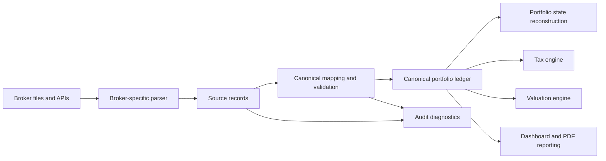
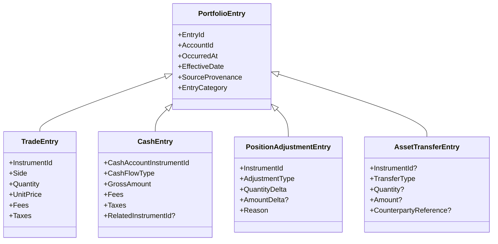
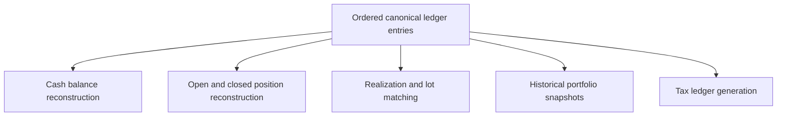

# Canonical Portfolio Ledger

This document defines the target canonical ledger model that should sit between broker import, portfolio tracking, valuation, and tax/reporting.

It is normative for the direction of the domain and application model, even though the current codebase still implements only a narrower event set.

## Purpose

The canonical portfolio ledger is the trusted internal representation of all portfolio-relevant activity.

It exists so that WealthIQ can:

- ingest multiple broker-specific formats into one consistent model
- reconstruct holdings, cash balances, realized activity, and historical state at any point in time
- support tracking, valuation, tax reporting, dashboard views, and later strategy reconciliation from the same source of truth
- enforce fail-fast validation when imported data is incomplete, ambiguous, or unmapped

## Core Principle

External source records are never consumed directly by tax logic, valuation logic, or dashboard logic.
They must first be normalized into canonical ledger entries with explicit provenance.

## High-Level Flow

## Design Goals

- one canonical timeline across all supported brokers
- representation of both security activity and cash activity
- strict provenance from canonical entry back to source record
- correct multi-currency handling with explicit EUR conversion points
- enough semantic detail to support tracking, valuation, and tax rules without broker-specific fields leaking inward
- extensibility for future asset classes without redesigning the core ledger every time

## Scope Of The Canonical Ledger

The ledger should model facts, not reports.

It should contain:

- canonical portfolio events
- canonical asset and account references
- monetary amounts with explicit currencies
- provenance to source broker, file, and source line or transaction reference
- validation status that determines whether processing may continue

It should not contain:

- dashboard-only view state
- PDF layout concerns
- strategy signals
- derived position snapshots as the only source of truth

Derived states such as current holdings, realized PnL, tax entries, allocation breakdowns, and historical portfolio value must be rebuilt from the ledger.

## Canonical Model Overview

### Main Building Blocks

- `PortfolioLedger`: immutable ordered collection of canonical entries plus instruments, accounts, and diagnostics
- `PortfolioEntry`: abstract base type for one canonical fact in the ledger timeline
- `Instrument`: canonical tradable or cash-like asset metadata
- `Account`: canonical account identity independent of broker file format
- `SourceProvenance`: reference back to the original import source

### Entry Categories

The canonical ledger should distinguish a small number of semantic entry families.

## Canonical Entry Families

### Trade Entries

Use for executed buy and sell activity in a tradable instrument.

Required semantics:

- instrument identity
- buy or sell side
- quantity
- price and price currency
- fees and taxes
- source reference and timestamps
- no embedded EUR conversion data in the canonical entry itself

Trade entries are the basis for:

- open and closed position reconstruction
- FIFO realization
- cost-basis tracking
- strategy-execution reconciliation later

### Cash Entries

Use for cash-affecting events that are not themselves trades.

Examples relevant to the stated product scope:

- dividends
- interest
- withholding tax
- broker fees if they occur as standalone cash rows
- deposits and withdrawals if the broker data exposes them
- later other tax-relevant or operational cash movements

Required semantics:

- amount and currency
- cash-flow type
- optional related instrument
- optional tax classification metadata where needed by tax logic
- provenance metadata

### Position Adjustment Entries

Use for changes in position state that are not ordinary buys or sells.

Examples:

- stock split
- reverse split
- merger-driven quantity change
- manual correction after an audited import discrepancy
- later other corporate actions once their treatment is explicitly designed

This family is important because position state must remain reconstructible even when the source broker represents a change in a non-trade way.

### Asset Transfer Entries

Use for movements between locations without treating them as economic buys or sells.

Examples:

- cash transfer
- asset transfer between brokers
- internal portfolio relocation

This family prevents false realized PnL and false tax events when holdings move but are not economically disposed.

## Required Shared Metadata

Every canonical ledger entry should carry:

- stable `EntryId`
- `AccountId`
- `OccurredAt` timestamp
- `EffectiveDate` for date-based reporting and valuation
- `SourceProvenance`
- broker-neutral entry category
- fail-fast validation status or blocking diagnostics when mapping is incomplete

## Source Provenance

Each canonical entry must remain traceable back to the imported source.

Minimum provenance fields:

- broker
- import format
- file or external source identifier
- original source transaction/reference id if available
- source section, line, or record identifier when available

This provenance is required for:

- manual audit of unmapped or suspicious imports
- traceable tax reports
- later reconciliation with broker statements

## Asset And Instrument Model Requirements

The canonical instrument model must separate stable identity from mutable enrichments.

It should support at least:

- stable instrument identity
- asset class
- symbol/ticker
- ISIN and other external identifiers where available
- trading currency
- tax-relevant classification metadata
- provider mapping keys for market-data lookup

### Asset Class Direction

The model must support at least these near-term classes:

- ETF
- leveraged ETF
- ETC
- stock
- crypto
- bond

It must remain extensible for later additional classes without redesigning the ledger base type.

## Currency Model Requirements

The ledger must preserve source-currency truth and still support EUR-based reporting.

Required principles:

- source amounts remain explicit in their source currency
- currency conversion is applied later in calculation layers, not embedded into canonical ledger entries
- valuation and tax calculations must know whether they rely on trade-time conversion or valuation-time conversion
- missing price or FX data must block calculation instead of silently degrading output

### FX Conversion Layer Direction

The canonical ledger should stay immutable and source-fact based after import.
Currency conversion should happen in a separate FX conversion layer that can be reused by dashboard, valuation, and tax logic.

That later layer should be able to:

- convert source-currency amounts into a chosen base currency such as EUR
- use an FX lookup table or provider
- support different conversion contexts such as trade-time conversion and valuation-date conversion
- fail when required FX data is missing

If a broker provides its own converted amount or FX rate, that should be treated as optional source data for audit/reference purposes, not as a required field on every canonical ledger entry.

## Ledger Reconstruction Rules

The ledger must support replay into derived states.

Derived states must be reproducible from the ordered ledger plus reference data.

## Validation And Fail-Fast Rules

The canonical ledger is only valid if every imported record is either:

- mapped into a canonical entry with required fields present
- or rejected with a blocking diagnostic that stops the run

The following conditions must be treated as blocking at the ledger boundary unless explicitly overridden by later documented rules:

- missing required source identifiers
- unsupported but present broker record types within the declared supported scope
- unmapped asset or event categories
- ambiguous instrument identity
- missing required currencies or amounts
- inconsistent sign conventions that cannot be resolved deterministically
- impossible or missing data needed to preserve the source fact faithfully

## Domain And Application Ownership

### Domain Should Own

- canonical entry types and value objects
- asset and account identity types
- provenance value types
- small invariants on canonical entries

### Application Should Own

- import orchestration
- mapping validation policy
- replay of canonical entries into derived states
- lot matching, valuation, and tax processing over the canonical ledger

### Infrastructure Should Own

- broker-specific parsers
- extraction of source rows from XML, CSV, PDF, or API payloads
- source-specific field normalization before canonical mapping completes

## Relationship To The Current Implementation

The earlier `AccountEvent` hierarchy was a transition model during the move from a tax-specific import pipeline toward a general portfolio ledger.
That legacy model has now been removed from the active pipeline.

The canonical ledger defined here extends the old narrow event direction by requiring:

- broader cash-flow coverage
- explicit provenance as a first-class architectural concern
- non-trade position and transfer events
- stronger multi-currency and multi-asset modeling
- replayability for tracking and valuation, not only tax calculation

## Consequences For Next Design Work

This document makes the following next tasks concrete:

- define the precise fail-fast import contract and blocking diagnostic policy
- design the multi-broker import architecture around raw source records and canonical mapping
- define the market-data and FX-rate boundary needed for valuation replay
- define first-release tax scope on top of the canonical ledger rather than directly on broker-specific imports

## Migration Decision

The canonical ledger is now the single intended core model.
WealthIQ should not reintroduce a second parallel core event model.

Migration policy:

- new features must build on `PortfolioEntry` and `PortfolioLedger`
- replay-based workflows should consume the ledger directly
- any compatibility or adapter code should be temporary and isolated
