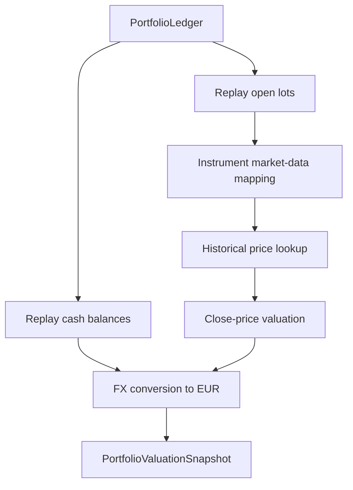

# Portfolio Valuation

This document describes the current portfolio-valuation foundation for WealthIQ.

## Purpose

Portfolio valuation rebuilds current or historical holdings from the canonical ledger and values them in EUR using:

- explicit instrument-to-market-data mapping
- historical OHLCV price data
- the shared FX conversion layer

## Core Rules

- the valuation source of truth is the canonical `PortfolioLedger`
- prices are never matched by broker symbol alone
- each priced instrument must be mapped explicitly, typically by ISIN
- missing market-data mapping or missing historical prices is a blocking error
- valuation uses normal `Close` price for now
- if the requested date is not a trading day, the latest available price on or before that date is used

## Current Contracts

- `IInstrumentMarketDataMap`
- `IHistoricalPriceLookup`
- `PriceLookupDateHandling`
- `PortfolioValuationService`

Main output:

- `PortfolioValuationSnapshot`
  - valued positions
  - valued cash balances
  - total portfolio value in EUR

## Mapping Model

The first implementation uses a JSON mapping file:

- path: `data/old_project/Frontend/ConsoleUi/Sigmatic.Console/Input/Configuration/market_data_mappings.json`
- key: ISIN
- value: explicit provider symbol and notes

Reason:

- European ETFs and ETCs can share visible symbols across exchanges while trading in different currencies
- broker-export symbols alone are not a safe market-data key
- explicit mapping is required to make the downloaded price series match broker reality

## Current Price Data Model

The first CSV-based prototype stores:

- `date`
- `provider_symbol`
- `currency`
- `open`
- `high`
- `low`
- `close`
- `adjusted_close`
- `volume`
- `isin`

Current runtime use:

- `close` is used for portfolio valuation
- `adjusted_close` is stored for later backtesting and strategy work

## Valuation Flow

## Replay Scope Implemented Today

`PortfolioValuationService` currently:

- replays `TradeEntry` values into open lots using FIFO matching
- replays trade and cash entries into cash balances per currency
- values long positions as positive market value
- values short positions as negative market value
- converts both security values and cash balances into EUR through the shared FX layer

## Date Handling

- requested valuation date can be any calendar day
- historical prices are looked up using `LatestOnOrBefore`
- current portfolio valuation can therefore use the latest available close if no same-day price exists yet

## Fail-Fast Rules

- no mapping for an instrument ISIN -> error
- no historical price for the mapped provider symbol on or before valuation date -> error
- no FX rate for security currency or cash currency -> error
- no silent substitution through broker symbols -> error

## Data Preparation Scripts

- FX data: `scripts/download_fx_rates.py`
- OHLCV price data: `scripts/download_price_history.py`

The price script downloads five years of daily OHLCV data from Yahoo Finance using the explicit mapping file and writes:

- `data/old_project/Frontend/ConsoleUi/Sigmatic.Console/Input/Configuration/historical_prices.csv`

## Current Limits

- only CSV-backed historical prices are implemented
- runtime valuation is not yet wired into the CLI output
- market-data mapping is file-based and manual
- alternate base currencies are not implemented yet
